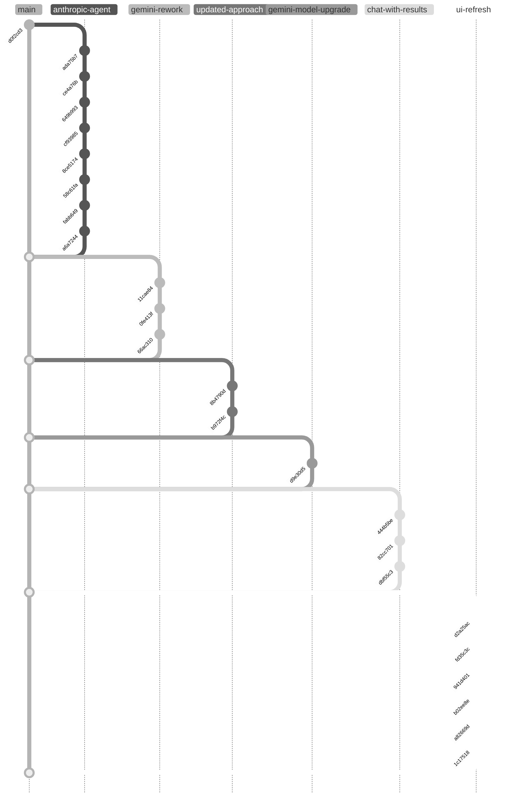

# SPD MATRIX


**SPD MATRIX** is a browser-based tool for comparing pension plan documents across multiple plan units. Built for post-merger standardization, it uses Google Gemini's 1M-token context window to analyze complete SPDs side-by-side, producing executive summaries, comparison matrices, and detailed language extractions with exact page citations—work that would cost thousands at a law firm, completed in minutes for a few dollars.

## Getting Started

### Local Development
1. Copy `config.example.js` to `config.js` and add your [Gemini API key](https://aistudio.google.com/app/apikey)
2. Open `index.html` in a browser
3. Upload plan documents and click "Compare Documents"

### Cloudflare Deployment
The `cloudflare/` directory contains a ready-to-deploy Cloudflare Workers configuration with:
- **Server-side API proxy**: Worker proxies Gemini API requests, keeping the API key completely hidden from browsers (not even in HTML source)
- **Authentication ready**: Configure Cloudflare Access with email OTP for user allowlists
- **NFR mode**: Settings modal shows "NFR API key provided for testing" notice with server-side security indicator

```bash
cd cloudflare
wrangler secret put GEMINI_API_KEY    # Add your API key
wrangler deploy                        # Deploy to Cloudflare
```

For local testing: `wrangler dev` (uses `.dev.vars` for secrets)

## Development History



### Timeline

**November 5, 2025 — Initial Development (Claude API)**
- `d0f2cd3` Project structure and configuration scaffold
- `ada75b7` SPD Plan Comparison Agent chat interface with Claude integration
- `ce4a76b` Page title update and CLAUDE.md documentation
- `649b993` Plan Docs file upload with base64 PDF encoding
- `cf93985` File upload implementation refinements
- `8ce5174` System prompt integration with prompt caching
- `58c61fa` "Compare Documents" button for initial interaction workflow
- `fabb649` Documentation updates
- `a6a7244` UI redesign with modern light mode and monochrome aesthetic

**November 11, 2025 — Gemini Migration**
- `11cae84` **Major pivot:** Migrate from Claude to Google Gemini 2.5 Pro (10x page limits, 5x context)
- `0fe413f` Three-output tabbed interface (Summary, Comparison, Language)
- `66ac310` UX improvements: loading indicators, smart progress detection

**November 12, 2025 — Three-Phase Workflow**
- `8b4790d` Multi-turn workflow experiment (reverted)
- `b972f4c` **Architecture change:** Three-phase sequential API with progressive context engineering

**November 21, 2025 — Gemini 3 Pro + Chat**
- `d9e30d5` Upgrade to Gemini 3 Pro Preview (65k token output, advanced reasoning)
- `444b5be` Interactive chat feature for post-comparison analysis
- `82cc701` Chat UI refactor to permanent collapsed sidebar
- `dbf55c3` README update with three-phase and chat documentation

**November 25-26, 2025 — Production Polish**
- `d2a25ac` Live streaming tabs replace static loading screen
- `fd35c3c` Smarter tab switching and status updates during streaming
- `941d401` UI polish: citation highlighting, downloads, chat panel, settings
- `b02ee8e` QA test outputs and comparative analysis
- `a82669d` Rebrand to "SPD MATRIX" with professional enterprise UI
- `1c17518` Repository cleanup (remove internal directories)
- `3a5e982` **Clickable citations:** Click any citation to open the source PDF at the referenced page

**November 28, 2025 — Cloudflare Deployment**
- Add Cloudflare Workers deployment configuration with server-side API proxy
- Worker proxies all Gemini API requests, injecting API key server-side (never exposed to browser)
- Settings modal shows "NFR API key provided for testing" with "Secured server-side" indicator
- Ready for Cloudflare Access authentication (email OTP with user allowlist)

## License

Not licensed for external distribution.
