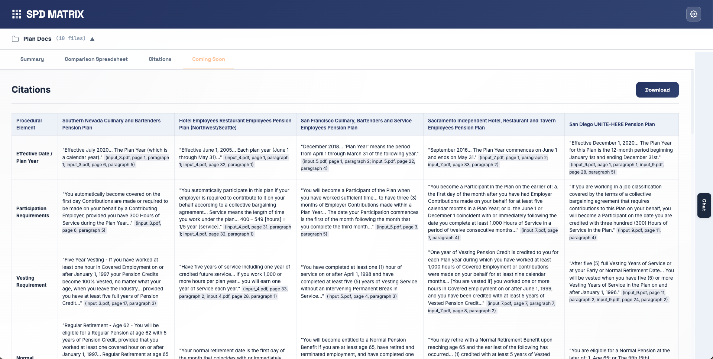
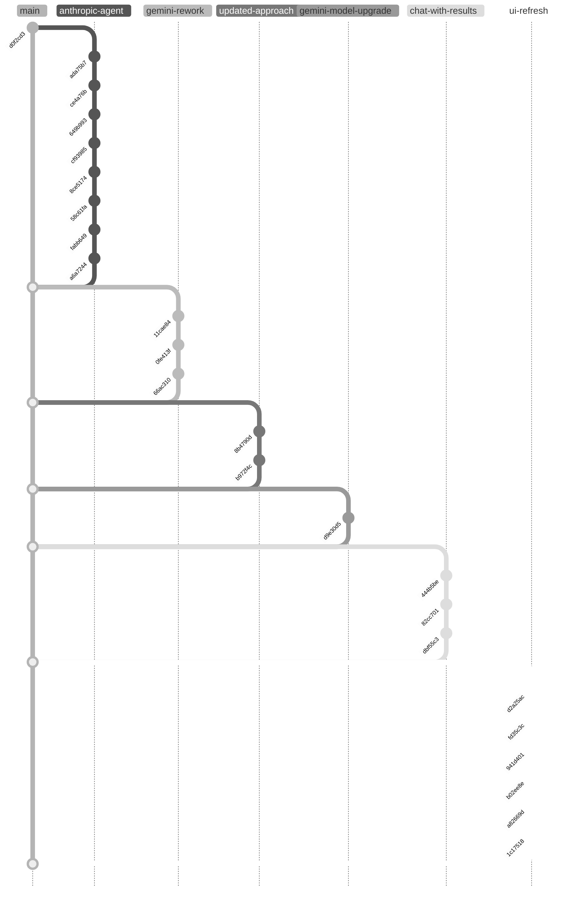

# SPD MATRIX



**SPD MATRIX** is a browser-based tool for comparing pension plan documents across multiple plan units. Built for post-merger standardization, it uses Google Gemini's 1M-token context window to analyze complete SPDs side-by-side, producing executive summaries, comparison matrices, and detailed language extractions with exact page citations—work that would cost thousands at a law firm, completed in minutes for a few dollars.

**Key Features:**
- **Three-phase analysis:** Document summary → Comparison matrix → Detailed language extraction with citations
- **Interactive chat:** Ask follow-up questions about the analysis with full document context
- **Session history:** Save and reload analyses with Railway PostgreSQL backend
- **Persistent document storage:** PDFs stored in Cloudflare R2 for seamless session reload and clickable citations
- **Notes/annotations:** Highlight text and add Google Docs-style notes that persist across sessions
- **Sticky table headers:** Column labels stay visible while scrolling through large comparison matrices
- **Cross-browser PDF viewer:** PDF.js-based citation viewer ensures correct page navigation in Safari, Chrome, and all browsers

## Getting Started

### Local Development
1. Copy `config.example.js` to `config.js` and add your [Gemini API key](https://aistudio.google.com/app/apikey)
2. Open `index.html` in a browser
3. Upload plan documents and click "Compare Documents"

### Cloudflare Pages Deployment
The repo is configured for Cloudflare Pages deployment with a unified codebase:
- **Single `index.html`**: Auto-detects local vs. Cloudflare environment at runtime
- **Server-side API proxy**: Pages Function at `functions/api/gemini/[model].js` proxies requests, keeping the API key hidden
- **Custom domain support**: Pages supports external DNS via CNAME (works with Squarespace, GoDaddy, etc.)
- **Cloudflare Access**: Multi-provider authentication (Google OAuth, Microsoft Entra ID, OTP fallback) with email allowlist

```bash
wrangler pages deploy .                    # Deploy to production
wrangler pages secret put GEMINI_API_KEY   # Add API key (first time only)
```

For local testing with proxy: `wrangler pages dev .` (uses `.dev.vars` for secrets)

**Custom Domain Setup:**
1. In Cloudflare Pages dashboard, add custom domain (e.g., `spd-matrix.yourdomain.com`)
2. Add CNAME record in your DNS provider pointing to `spd-matrix.pages.dev`
3. Cloudflare handles SSL automatically

## Development History



### Timeline

**November 5, 2025 — Initial Development (Claude API)**
- `d0f2cd3` Project structure and configuration scaffold
- `ada75b7` SPD Plan Comparison Agent chat interface with Claude integration
- `ce4a76b` Page title update and CLAUDE.md documentation
- `649b993` Plan Docs file upload with base64 PDF encoding
- `cf93985` File upload implementation refinements
- `8ce5174` System prompt integration with prompt caching
- `58c61fa` "Compare Documents" button for initial interaction workflow
- `fabb649` Documentation updates
- `a6a7244` UI redesign with modern light mode and monochrome aesthetic

**November 11, 2025 — Gemini Migration**
- `11cae84` **Major pivot:** Migrate from Claude to Google Gemini 2.5 Pro (10x page limits, 5x context)
- `0fe413f` Three-output tabbed interface (Summary, Comparison, Language)
- `66ac310` UX improvements: loading indicators, smart progress detection

**November 12, 2025 — Three-Phase Workflow**
- `8b4790d` Multi-turn workflow experiment (reverted)
- `b972f4c` **Architecture change:** Three-phase sequential API with progressive context engineering

**November 21, 2025 — Gemini 3 Pro + Chat**
- `d9e30d5` Upgrade to Gemini 3 Pro Preview (65k token output, advanced reasoning)
- `444b5be` Interactive chat feature for post-comparison analysis
- `82cc701` Chat UI refactor to permanent collapsed sidebar
- `dbf55c3` README update with three-phase and chat documentation

**November 25-26, 2025 — Production Polish**
- `d2a25ac` Live streaming tabs replace static loading screen
- `fd35c3c` Smarter tab switching and status updates during streaming
- `941d401` UI polish: citation highlighting, downloads, chat panel, settings
- `b02ee8e` QA test outputs and comparative analysis
- `a82669d` Rebrand to "SPD MATRIX" with professional enterprise UI
- `1c17518` Repository cleanup (remove internal directories)
- `3a5e982` **Clickable citations:** Click any citation to open the source PDF at the referenced page

**November 28, 2025 — Cloudflare Pages & Unified Codebase**
- Convert from Cloudflare Workers to Pages for custom domain support with external DNS
- Pages Function proxies Gemini API requests with server-side key injection (never exposed to browser)
- Custom domain configured via CNAME from Squarespace DNS
- Cloudflare Access configured with email allowlist policy
- **Unified codebase:** Single `index.html` with runtime environment detection (eliminates duplicate files)
- **Citation regex fix:** Handle quoted filenames in model output (e.g., `("filename.pdf", Page 6)`)
- Settings modal adapts to show API key input (local) or "Secured server-side" indicator (Cloudflare)

**December 15, 2025 — Session History**
- Railway PostgreSQL backend for persistent storage
- User-specific session history via Cloudflare Access email header
- Save/load analyses with all three phases and chat messages preserved
- Hyperdrive connection pooling for optimal database performance

**December 18, 2025 — Notes Feature**
- Google Docs-style annotations on any highlighted text in analysis tabs
- Text anchoring with prefix/suffix context for reliable restoration
- Immediate auto-save to PostgreSQL backend
- Notes persist across sessions and reload with saved analyses
- Markdown support in note content with inline rendering

**December 22, 2025 — Multi-Provider Authentication**
- Replaced slow email OTP as primary login with instant social login options
- Added Google OAuth identity provider (works with any email via Google account)
- Added Microsoft Entra ID identity provider (multi-tenant, supports any MS365 organization)
- Email allowlist policy unchanged—controls WHO can access regardless of login method
- Users now see three login options: Google, Microsoft, or One-time PIN fallback

**December 22, 2025 — Persistent Document Storage (Cloudflare R2)**
- PDFs now stored in Cloudflare R2 object storage after analysis completes
- Session reload fetches documents from R2—no need to re-upload files
- Citations work immediately when loading saved sessions (R2 URL with `#page=N`)
- Chat feature works with reloaded sessions (documents re-sent to Gemini from R2)
- R2 cascade delete: files automatically removed when analysis is deleted
- Foundation for future session sharing (authenticated users can access shared documents)

**January 7, 2026 — Sticky Table Headers**
- Table column headers now freeze at the top when scrolling through comparison matrices
- Output header ("Comparison Spreadsheet", etc.) also sticks to prevent content gaps
- Subtle box-shadow provides visual separation between frozen header and scrolled content

**January 7, 2026 — Safari Compatibility & PDF.js Viewer**
- **Notes popup fix:** Safari-specific event delegation issues prevented note popups from reopening after clicking the close button; replaced inline `onclick` with `addEventListener` and added direct click handlers on highlight elements
- **PDF.js citation viewer:** Safari's built-in PDF viewer ignores `#page=N` URL fragments; added `viewer.html` using PDF.js to ensure citations navigate to the correct page in all browsers
- **Old session citation fix:** Citations in pre-R2 sessions showed "File not found" due to overly strict file filtering; now correctly displays "PDF unavailable (pre-storage session)" with proper tooltip messaging

## License

Not licensed for external distribution.
