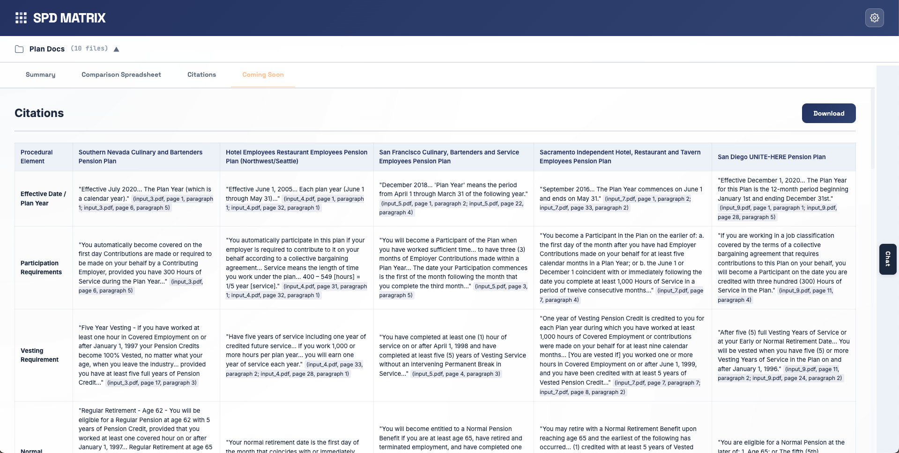
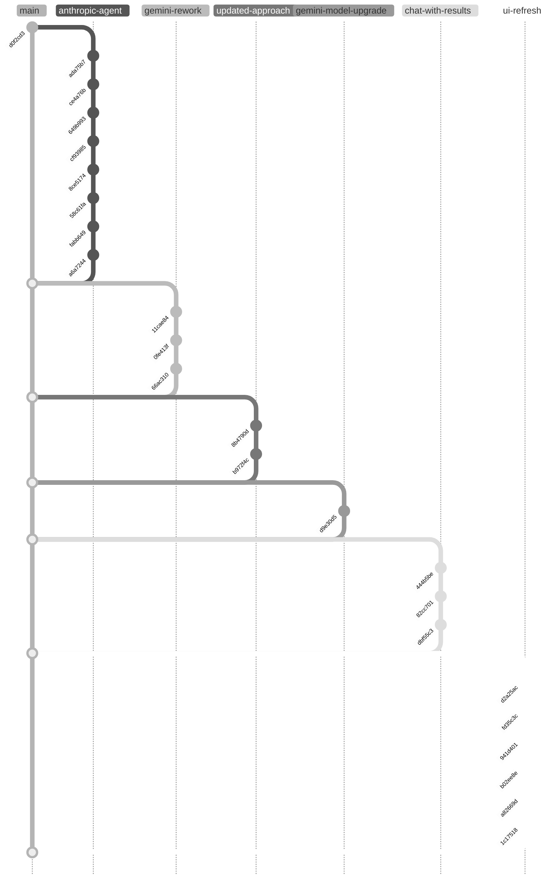

# SyncroDoc



**SyncroDoc** (formerly SPD MATRIX) is a browser-based tool for comparing pension plan documents across multiple plan units. Built for post-merger standardization, it uses Google Gemini's 1M-token context window to analyze complete SPDs side-by-side, producing executive summaries, comparison matrices, and detailed language extractions with exact page citations—work that would cost thousands at a law firm, completed in minutes for a few dollars.

**Key Features:**
- **Three-phase analysis:** Document summary → Comparison matrix → Detailed language extraction with citations
- **Analysis mode selector:** Split-button dropdown on the Compare button lets users choose Cross-Plan Comparison, Amendment Tracking, Minutes Analysis, or Invoice Analysis — each mode appends context-specific addenda to prompts
- **Timeline visualization (Minutes Analysis):** Meeting notes are analyzed via a 2-phase AI workflow producing structured JSON, then rendered as an interactive horizontal timeline with topic filtering, thread tracing, detail panels with citations, custom AI search, and an integrated chat sidebar — exportable as topic-centric DOCX/PDF reports with a Decision Register and per-topic chronological analysis
- **Invoice analysis:** Invoices and billing statements analyzed via batched 2-phase AI extraction with Chart.js visualization, vendor/category breakdowns, and an integrated billing-analyst chat
- **Interactive tables:** Sort columns, filter by value, drag-reorder rows via visible handles, and ask AI to group related provisions
- **Multi-turn chat with compaction:** Ask follow-up questions with full conversation history; long sessions auto-summarize to stay within context limits
- **Session history:** Save, reload, and duplicate analyses with Railway PostgreSQL backend
- **Persistent document storage:** PDFs stored in Cloudflare R2 for seamless session reload and clickable citations
- **Merge workspace:** Select provisions from the comparison table, generate an AI-synthesized integrated column, then produce a formatted SPD draft — all editable with inline AI rework
- **Action-flagged notes:** Mark annotations as "actionable" to pass them as instructions to the AI during draft generation; toggle note types inline from the Merge selection view
- **Notes/annotations:** Highlight text and add Google Docs-style notes that persist across sessions
- **Sticky table headers:** Column labels stay visible while scrolling through large comparison matrices
- **Multi-format export:** Export results as CSV, XLSX, Word (.docx), PDF, or push directly to Google Sheets (including Summary tab)
- **Session inactivity timeout:** Auto-logout after 4 hours of inactivity with a 5-minute warning dialog
- **Cross-browser PDF viewer:** PDF.js-based citation viewer ensures correct page navigation in Safari, Chrome, and all browsers

## Getting Started

### Local Development
1. Copy `config.example.js` to `config.js` and add your [Gemini API key](https://aistudio.google.com/app/apikey)
2. Open `index.html` in a browser
3. Upload plan documents and click "Compare Documents"

### Cloudflare Pages Deployment
The repo is configured for Cloudflare Pages deployment with a unified codebase:
- **Single `index.html`**: Auto-detects local vs. Cloudflare environment at runtime
- **Server-side API proxy**: Pages Function at `functions/api/gemini/[model].js` proxies requests, keeping the API key hidden
- **Custom domain support**: Pages supports external DNS via CNAME (works with Squarespace, GoDaddy, etc.)
- **Cloudflare Access**: Multi-provider authentication (Google OAuth, Microsoft Entra ID, OTP fallback) with email allowlist

```bash
wrangler pages deploy .                    # Deploy to production
wrangler pages secret put GEMINI_API_KEY   # Add API key (first time only)
```

For local testing with proxy: `wrangler pages dev .` (uses `.dev.vars` for secrets)

**Custom Domain Setup:**
1. In Cloudflare Pages dashboard, add custom domain (e.g., `spd-matrix.yourdomain.com`)
2. Add CNAME record in your DNS provider pointing to `spd-matrix.pages.dev`
3. Cloudflare handles SSL automatically

## Development History


```mermaid
%%{init: { 'theme': 'neutral' } }%%
gitGraph TB:
    commit id: "d0f2cd3"
    branch anthropic-agent
    commit id: "ada75b7"
    commit id: "ce4a76b"
    commit id: "649b993"
    commit id: "cf93985"
    commit id: "8ce5174"
    commit id: "58c61fa"
    commit id: "fabb649"
    commit id: "a6a7244"
    checkout main
    merge anthropic-agent
    branch gemini-rework
    commit id: "11cae84"
    commit id: "0fe413f"
    commit id: "66ac310"
    checkout main
    merge gemini-rework
    branch updated-approach
    commit id: "8b4790d"
    commit id: "b972f4c"
    checkout main
    merge updated-approach
    branch gemini-model-upgrade
    commit id: "d9e30d5"
    checkout main
    merge gemini-model-upgrade
    branch chat-with-results
    commit id: "444b5be"
    commit id: "82cc701"
    commit id: "dbf55c3"
    checkout main
    merge chat-with-results
    branch ui-refresh
    commit id: "d2a25ac"
    commit id: "fd35c3c"
    commit id: "941d401"
    commit id: "b02ee8e"
    commit id: "a82669d"
    commit id: "1c17518"
    checkout main
    merge ui-refresh
```

### Timeline

**November 5, 2025 — Initial Development (Claude API)**
- `d0f2cd3` Project structure and configuration scaffold
- `ada75b7` SPD Plan Comparison Agent chat interface with Claude integration
- `ce4a76b` Page title update and CLAUDE.md documentation
- `649b993` Plan Docs file upload with base64 PDF encoding
- `cf93985` File upload implementation refinements
- `8ce5174` System prompt integration with prompt caching
- `58c61fa` "Compare Documents" button for initial interaction workflow
- `fabb649` Documentation updates
- `a6a7244` UI redesign with modern light mode and monochrome aesthetic

**November 11, 2025 — Gemini Migration**
- `11cae84` **Major pivot:** Migrate from Claude to Google Gemini 2.5 Pro (10x page limits, 5x context)
- `0fe413f` Three-output tabbed interface (Summary, Comparison, Language)
- `66ac310` UX improvements: loading indicators, smart progress detection

**November 12, 2025 — Three-Phase Workflow**
- `8b4790d` Multi-turn workflow experiment (reverted)
- `b972f4c` **Architecture change:** Three-phase sequential API with progressive context engineering

**November 21, 2025 — Gemini 3 Pro + Chat**
- `d9e30d5` Upgrade to Gemini 3 Pro Preview (65k token output, advanced reasoning)
- `444b5be` Interactive chat feature for post-comparison analysis
- `82cc701` Chat UI refactor to permanent collapsed sidebar
- `dbf55c3` README update with three-phase and chat documentation

**November 25-26, 2025 — Production Polish**
- `d2a25ac` Live streaming tabs replace static loading screen
- `fd35c3c` Smarter tab switching and status updates during streaming
- `941d401` UI polish: citation highlighting, downloads, chat panel, settings
- `b02ee8e` QA test outputs and comparative analysis
- `a82669d` Rebrand to "SPD MATRIX" with professional enterprise UI
- `1c17518` Repository cleanup (remove internal directories)
- `3a5e982` **Clickable citations:** Click any citation to open the source PDF at the referenced page

**November 28, 2025 — Cloudflare Pages & Unified Codebase**
- Convert from Cloudflare Workers to Pages for custom domain support with external DNS
- Pages Function proxies Gemini API requests with server-side key injection (never exposed to browser)
- Custom domain configured via CNAME from Squarespace DNS
- Cloudflare Access configured with email allowlist policy
- **Unified codebase:** Single `index.html` with runtime environment detection (eliminates duplicate files)
- **Citation regex fix:** Handle quoted filenames in model output (e.g., `("filename.pdf", Page 6)`)
- Settings modal adapts to show API key input (local) or "Secured server-side" indicator (Cloudflare)

**December 15, 2025 — Session History**
- Railway PostgreSQL backend for persistent storage
- User-specific session history via Cloudflare Access email header
- Save/load analyses with all three phases and chat messages preserved
- Hyperdrive connection pooling for optimal database performance

**December 18, 2025 — Notes Feature**
- Google Docs-style annotations on any highlighted text in analysis tabs
- Text anchoring with prefix/suffix context for reliable restoration
- Immediate auto-save to PostgreSQL backend
- Notes persist across sessions and reload with saved analyses
- Markdown support in note content with inline rendering

**December 22, 2025 — Multi-Provider Authentication**
- Replaced slow email OTP as primary login with instant social login options
- Added Google OAuth identity provider (works with any email via Google account)
- Added Microsoft Entra ID identity provider (multi-tenant, supports any MS365 organization)
- Email allowlist policy unchanged—controls WHO can access regardless of login method
- Users now see three login options: Google, Microsoft, or One-time PIN fallback

**December 22, 2025 — Persistent Document Storage (Cloudflare R2)**
- PDFs now stored in Cloudflare R2 object storage after analysis completes
- Session reload fetches documents from R2—no need to re-upload files
- Citations work immediately when loading saved sessions (R2 URL with `#page=N`)
- Chat feature works with reloaded sessions (documents re-sent to Gemini from R2)
- R2 cascade delete: files automatically removed when analysis is deleted
- Foundation for future session sharing (authenticated users can access shared documents)

**January 7, 2026 — Sticky Table Headers**
- Table column headers now freeze at the top when scrolling through comparison matrices
- Output header ("Comparison Spreadsheet", etc.) also sticks to prevent content gaps
- Subtle box-shadow provides visual separation between frozen header and scrolled content

**January 7, 2026 — Safari Compatibility & PDF.js Viewer**
- **Notes popup fix:** Safari-specific event delegation issues prevented note popups from reopening after clicking the close button; replaced inline `onclick` with `addEventListener` and added direct click handlers on highlight elements
- **PDF.js citation viewer:** Safari's built-in PDF viewer ignores `#page=N` URL fragments; added `viewer.html` using PDF.js to ensure citations navigate to the correct page in all browsers
- **Old session citation fix:** Citations in pre-R2 sessions showed "File not found" due to overly strict file filtering; now correctly displays "PDF unavailable (pre-storage session)" with proper tooltip messaging

**January 22, 2026 — Citation Regex Fix**
- Fixed clickable citations not working when Gemini outputs `p.` page format (e.g., `(filename.pdf, p. 1)`)
- Citation regex now matches `p`, `p.`, `pg`, `pg.`, and `page` prefixes

**February 5, 2026 — Export Menu & Google Sheets Integration**
- Replaced single "Download" buttons with Export dropdown menus on all three analysis tabs
- Summary tab offers CSV and XLSX export; Comparison and Citations tabs add "Push to Google Sheets"
- XLSX generation uses SheetJS (already loaded for file reading) with auto-sized columns
- Google Sheets integration uses Google Identity Services OAuth with the existing Cloudflare Access OAuth Client ID
- Sheets export creates a formatted spreadsheet (bold frozen header, text wrapping, sized columns) and opens it in a new tab
- Markdown formatting (`**bold**`, `<br>` tags) stripped during export; separator rows filtered out
- Google Sheets API enabled in existing "SPD Matrix Auth" GCP project; OAuth consent screen set to Production
- Export buttons now correctly appear when loading saved analyses (bug fix)

**February 5, 2026 — Interactive Table Controls**
- Comparison and Citations tabs now render as interactive tables with sort, filter, and drag-reorder
- Click any column header to sort (ascending, descending, original); click the filter button to filter by value
- Drag rows from the first column to manually reorder
- AI-powered table rearrangement: ask the chat to "group similar provisions together" and the table reorganizes with labeled group headers
- Dual representation: markdown stays as source of truth for streaming/persistence; structured data drives interactive rendering after streaming completes
- View state (sort, filters, row order, AI groups) persists to `table_view_state` JSONB column and restores on session reload
- XLSX and Google Sheets exports respect the current view state (active sort, filtered rows excluded, group headers included)
- Citation highlighting applied per-cell to prevent regex from matching across HTML tag boundaries

**February 5, 2026 — Duplicate Session**
- Duplicate button on every history card (owned and shared) creates a full server-side copy
- Server-side endpoint copies analysis outputs, R2 files (with new keys), chat messages, notes with replies (remapping parent IDs), and table view state
- Duplicated sessions are fully independent—deleting the original doesn't affect the copy
- Rename modal opens immediately after duplication for convenient naming
- Toast notification system for non-blocking feedback
- New item added to local state directly to avoid Hyperdrive query cache staleness on sidebar refresh

**February 5, 2026 — Draft Workspace & Action-Flagged Notes**
- New "Draft" tab (4th tab) replaces "Coming Soon" — enabled after comparison completes
- Three-phase draft workflow: Selection → Integration → Draft Document
- Selection phase renders the comparison table with per-cell checkboxes; users choose which plan provisions to include (multiple plans per row supported for AI synthesis)
- Per-cell mini-prompts: textarea appears on selected cells for specific instructions (e.g., "prefer San Diego's language")
- Action-flagged notes: toggle any annotation between "observational" (yellow) and "actionable" (orange); actionable notes are passed as AI instructions during generation
- AI integration phase synthesizes selected provisions into a unified view via Gemini streaming
- AI draft phase transforms the integrated column into a formatted SPD section, using the original source documents' writing style as reference
- Both phases produce editable contenteditable divs with debounced auto-save
- Inline AI rework: highlight text in either editor → selection hint popup → enter instruction → AI replaces the selection (uses `execCommand` for browser undo support)
- Full persistence: selections, cell prompts, integrated column, draft content, and current phase saved to `draft_state` JSONB column and restored on session reload
- Export draft as TXT or Markdown
- In-app dialog system replaces all native `alert()`/`prompt()` calls with styled modals
- Fixed drag-and-drop breaking text selection on Comparison/Language tabs: rows are only made `draggable` when mousedown is on the first column, preserving normal text selection and note-taking elsewhere

**February 6, 2026 — UAT Feedback Fixes**
- Renamed "Draft" tab to "Merge" (display text only; all internal identifiers unchanged)
- Fixed AI Rework silently failing: the modal dialog was stealing focus, causing `execCommand('insertText')` to have no selection to replace; now saves the Range before the dialog and restores it after the AI responds
- Added DOCX and PDF export to the Merge tab via `html2pdf.js` and DOCX generation CDN libraries
- Actionable notes now visible inline in the Merge selection view: colored indicators on rows with notes, expandable panels with Obs/Act toggle switches
- Added visible drag handles (`⋮⋮`) to the first column of interactive tables so users can see and grab the drag target

**February 13, 2026 — UAT Feedback Round 2**
- Fixed old analysis content flashing when starting a new comparison: `runThreePhaseComparison()` now clears all previous state and output HTML before beginning
- Fixed "Plan Docs (0 files)" badge not updating when loading a saved session from history: `updateFilesCount()` now called after each R2 file restore
- Hardened DOCX/PDF export on Merge tab: added try/catch with user-visible error dialogs and library-load guards on all export methods
- Added Word (.docx) and PDF export to the Summary tab (previously only offered TXT and XLSX)
- Added "New Analysis" (+) button to the main header bar for discoverability (previously only available inside the History sidebar)
- Added client-side session inactivity timeout: warns after 4 hours of inactivity, auto-logs out via Cloudflare Access after 5-minute grace period

**February 13, 2026 — Fix Blank DOCX Exports**
- Replaced `html-docx-js` (unmaintained since 2016) with `@turbodocx/html-to-docx` for Word export
- `html-docx-js` used Microsoft Word's "altchunks" format which only renders in MS Word; all other apps (Apple Pages, Google Docs, LibreOffice) showed blank documents
- `@turbodocx/html-to-docx` generates proper OOXML that renders correctly across all word processors
- Added `global` shim for browser compatibility with the new library's Node.js assumptions
- Margins now controlled via OOXML twips (1440 = 1 inch) instead of CSS `margin: 1in`

**February 23, 2026 — Gemini 3.1 Pro Preview Upgrade**
- Upgraded from `gemini-3-pro-preview` to `gemini-3.1-pro-preview` across all API call sites
- Reasoning capability roughly doubled: ARC-AGI-2 score 77.1% vs prior model's ~35% — described by Google as "a step function improvement"
- Inline file upload limit increased from 20 MB to 100 MB per file, directly benefiting large SPD analysis
- New `'medium'` thinking level now available in `thinkingConfig.thinkingLevel` (in addition to `'low'` and `'high'`)
- All thinking levels standardized to `'high'` (including the draft rework path which previously used `'low'`)
- Same pricing as Gemini 3 Pro Preview; same 1M-token context window and 65,536-token output limit

**February 23, 2026 — Phase 2 Prompt: Domain Framing for Claims & Appeals**
- Diagnosed why Gemini 3.1 Pro Preview dropped Claims & Appeals rows that Gemini 3 Pro reliably produced
- Root cause: the Phase 2 prompt left "procedural elements" undefined; Gemini 3.1's deeper reasoning interpreted it as benefit mechanics (vesting, ages, formulas) rather than the legal/administrative reading an ERISA attorney would apply
- Claims & appeals language appears sparsely across documents (short, non-repeated) whereas benefit mechanics appear constantly with numeric specificity — higher-reasoning models weight by density, causing legally critical rows to lose out
- Fix: added a domain framing clause to the Phase 2 prompt explicitly enumerating both benefit mechanics and administrative/legal procedures (claims processes, appeal rights, deadlines, dispute resolution, venue)
- Approach chosen over prescribing specific required rows to preserve the model's ability to discover plan-specific elements in non-pension document sets

**February 25, 2026 — Citation Regex: Three-Part Hardening**
- QA'd all citations from a 22-file production run by cross-referencing DB responses against uploaded file metadata using a purpose-built Node.js QA script (`tests/citation-qa.js`)
- **Fix 1 — 120-char cap:** The original `.+?\.pdf` was too permissive; ERISA legal text with numbered provisions like `(1)...` caused the regex to capture hundreds of characters as a spurious "filename," either rendering citations as dead non-clickable spans or causing catastrophic backtracking that froze the browser tab. Changed to `.{1,120}?\.pdf`; the longest real filename in the document set is 112 chars
- **Fix 2 — Backtick delimiter support:** A subsequent production run revealed the model switched to backtick-quoted filenames (`` `filename.pdf` ``); the quote character class only handled `"`, `'`, and `&quot;`, so zero citations were detected. Added `` ` `` to both opening and closing optional quote groups
- **Fix 3 — HTML tag boundary:** Phone numbers and contact info in cells (e.g., `(702) 369-0000."<br>('LV-SPD...pdf, page 2, 2)`) caused the regex to span the `<br>` tag, starting a spurious match at the `(` of the phone number and consuming the real citation. Changed `.{1,120}?` to `[^<]{1,120}?` — real filenames never contain `<`, so the regex can no longer cross any HTML tag boundary
- Net result: all three failure modes eliminated; citations that previously showed as unstyled plain text or dead dashed-underline spans now render as clickable links opening the correct document at the correct page

**March 5, 2026 — Analysis Mode Selector**
- Users who uploaded single-fund documents (SPD + amendments) got a cross-plan comparison layout that didn't match expectations; the tool's prompts assumed multi-plan comparison
- Added a split-button dropdown attached to the "Compare Documents" button with three modes: Cross-Plan Comparison (default), Amendment Tracking, and Minutes Analysis
- Each mode appends context-specific addenda to all three phase prompts — base prompts stay identical, preserving existing behavior for cross-plan mode
- Amendment Tracking: columns ordered chronologically (Original SPD → Amendment 1 → 2 → etc.), rows track provision status (unchanged/modified/added/superseded) with effective dates
- Minutes Analysis: columns represent meetings chronologically, rows track topics/decisions/action items with status and responsible parties
- Selected mode persisted to `analysis_mode` column on `analyses` table and restored on session reload
- DB migration required: `ALTER TABLE analyses ADD COLUMN analysis_mode VARCHAR(30) DEFAULT 'cross-plan'`

**March 16, 2026 — SPD Regeneration Workflow for Amendment Tracking**
- When analysis mode is "Amendment Tracking," the Merge tab provides a full SPD regeneration workflow instead of the cross-plan selection/integration/draft pipeline
- Three-phase generation: Outline (editable) → Style Guide (editable) → Section-by-Section Generation → Assembled Document
- Definitions Registry Protocol: each section prompt includes `---DEFINITIONS---` delimiter; definitions accumulate across sections for consistency
- Section generation runs sequentially with previous section tail (~200 words) for continuity, plus section-specific actionable notes
- Pause/resume support: abort current stream and skip to next section, or resume from where you left off
- Per-section retry for failed generations; truncation detection via `finishReason === 'MAX_TOKENS'`
- Final assembled document is editable with inline AI Rework and exports to DOCX, PDF, or TXT

**March 18, 2026 — Vertex AI Support with Admin Panel**
- Admin users can configure Vertex AI as an alternative Gemini backend via the Settings modal
- Dual-path proxy in `functions/api/gemini/[model].js`: reads `app_settings` table per-request to choose Consumer API or Vertex AI
- JWT token minting via Web Crypto API (RS256) with automatic access token exchange
- Admin panel: radio toggle between Consumer/Vertex AI, service account JSON upload, manual field entry, "Test Connection" button
- Settings persisted to `app_settings` key-value table in PostgreSQL
- Fixed Vertex AI endpoint routing and settings modal overflow issues

**March 19, 2026 — Multi-Turn Chat with Compaction**
- Refactored chat from single-prompt-per-message to true multi-turn Gemini conversation
- Analysis context (summary, comparison, language tables) moved to `systemInstruction` instead of repeating in every message
- Documents attached to the first user turn in `contents`, not re-uploaded per message
- Automatic conversation compaction: after 10 turn-pairs (configurable), a cheap model (gemini-2.0-flash) summarizes the conversation history
- Compaction summary injected into `systemInstruction` for subsequent turns; only post-compaction messages sent as `contents`
- Visual "Conversation summarized" dividers in chat UI
- Compaction state persisted to DB via `is_compaction` flag on `chat_messages` table and reconstructed on session reload
- Schema migration: `is_compaction BOOLEAN` column on `chat_messages`, `system` role added to role constraint

**March 20, 2026 — Timeline-Based Minutes Analysis**
- Minutes Analysis mode now uses a completely different workflow: 2-phase AI analysis producing structured JSON instead of the 3-phase markdown table pipeline
- Phase 1 extracts a text summary plus a fenced JSON ontology of meetings and topics; Phase 2 extracts detailed per-topic excerpts and citations for each meeting
- Interactive horizontal timeline replaces the tab-based view: meeting nodes alternate above/below a central axis with topic color blips, connecting thread lines when a topic is filtered
- Topic filtering via dropdown panel with counts; active filter shows a horizontal evolution strip tracing a topic's progression across meetings
- Custom AI search: type a natural-language query to find related meetings across all data (makes a real API call, not just text matching)
- Detail panel opens on meeting click showing all topics discussed with excerpts and clickable PDF citations
- Integrated chat sidebar (collapsed by default) reuses the existing multi-turn chat infrastructure with a timeline-specific system instruction
- Rich phase progress indicator during analysis: glassmorphism card with SVG spinner, rotating contextual messages, and a 2-step progress tracker
- Session save/restore: meetings JSON stored in `comparison_response` column, view state (zoom, filters) in `table_view_state`; graceful fallback to tab view if timeline data can't be parsed
- Export as JSON or XLSX (flattened to Date/Meeting/Type/File/Topic/Excerpt/Citations rows)
- Cross-plan and amendment-tracking modes completely untouched — all changes gated behind `analysisMode === 'minutes-analysis'`
- No backend changes: same DB schema, same API endpoints

**March 21, 2026 — Invoice Analysis Mode**
- New `invoice-analysis` mode for invoices, billing statements, fee schedules, and cost reports
- 2-phase AI workflow: Phase 1 extracts vendor/category/period ontology, Phase 2 extracts cost data in batches of 3 periods with file filtering (only uploads files matching each batch's date range)
- Chart.js stacked bar visualization with vendor grouping and category color coding
- Stat cards for total spend, vendor count, category breakdown, and date range
- Integrated billing-analyst chat sidebar with full invoice context
- Session persistence: stores JSON in `comparison_response` column, restores workspace on reload

**March 21, 2026 — SSE Keepalive Proxy**
- Gemini proxy (`functions/api/gemini/[model].js`) now sends SSE keepalive comments (`: keepalive\n\n`) every 15 seconds
- Prevents Cloudflare's ~100-second idle timeout (HTTP 524) during long Gemini thinking pauses
- Returns the Response to the client immediately and pumps upstream data in the background via TransformStream
- Benefits all analysis modes, not just invoice analysis

**March 23, 2026 — Timeline DOCX & PDF Export**
- Meeting minutes timeline now exports as a topic-centric "Decision Archeology" report in Word (.docx) or PDF
- Document organized by topic (not by meeting) so readers can trace how each topic evolved across meetings
- Four sections: Executive Summary, Decision Register (all `[DECISION]`-tagged items in one table), Topic Analysis (per-topic chronological excerpts with colored left borders and decision badges), Meeting Index (appendix)
- DOCX uses `HTMLToDOCX` with Times New Roman body, Arial headings, 1-inch margins, and repeating header/footer
- PDF uses `html2pdf.js` with page numbers in the footer on every page
- No new libraries or backend changes; uses existing CDN-loaded export libraries

**March 23, 2026 — Database Migration Fix (Production Outage)**
- All users were getting "Failed to load analysis. It may have been deleted." when clicking any saved session from History
- Root cause: commit `9cece55` (Multi-Turn Chat with Compaction, March 19) added `is_compaction` to the `SELECT` query in `GET /api/history/analyses/:id` and `system` to the expected role constraint, but the corresponding database migrations were never applied
- The endpoint returned 500 for every session load because PostgreSQL rejected the query: `ERROR: column "is_compaction" does not exist`
- Applied two migrations: `ALTER TABLE chat_messages ADD COLUMN is_compaction BOOLEAN DEFAULT false` and updated `chat_messages_role_check` constraint to include `'system'`

**March 23, 2026 — Fix Chat Message Persistence**
- Chat messages sent immediately after a new analysis completed were silently lost due to a race condition: `saveAnalysis()` ran async (setting `currentAnalysisId` on completion), but chat was enabled immediately, so `saveChatMessages()` bailed on the null ID check
- Fixed by storing the `saveAnalysis()` promise and awaiting it in `saveChatMessages()` and `saveChatCompactionState()` before persisting — applies to all three analysis modes (cross-plan, timeline, invoice)
- Also moved chat message saving out of the owner-only PATCH block so non-owners on shared sessions can persist their chat conversations
- Added response status logging to `saveChatMessages()` so future save failures surface in the browser console instead of failing silently

**April 13, 2026 — Workspaces (shared document corpora)**
- New top-level organizational unit: a **workspace** groups a named corpus of documents plus the members who can access it
- Schema: `workspaces`, `workspace_members` (role: `admin` or `member`), `workspace_collections` (named groupings per workspace, analysis-mode-aware), `workspace_documents` (files per collection); `analyses.workspace_id` and `analyses.collection_id` link saved analyses to workspace context
- New endpoints: `GET /api/workspaces`, `GET|PATCH|DELETE /api/workspaces/:id`, `GET /api/workspaces/:id/members`, `GET /api/workspaces/:id/analyses`, `GET|POST /api/workspaces/:id/collections`, `GET|PATCH|DELETE /api/workspaces/:id/collections/:collectionId`, `GET|POST /api/workspaces/:id/collections/:collectionId/documents`, admin-only `POST|PATCH|DELETE /api/admin/workspaces/:id`
- New frontend: workspace switcher in header, workspace dashboard (members + analyses + collections), admin workspace creation/management; existing history endpoint extended to LEFT JOIN workspaces and surface `workspace_name` on owned analyses
- Shared access: `checkAnalysisAccess()` now returns workspace-member access alongside owner/shared-with paths; `_db.js` gains `checkWorkspaceMembership()`, `requireWorkspaceAdmin()`, `requireWorkspaceMember()` helpers
- Saved analyses are still personal by default (`workspace_id IS NULL`); only personal analyses are subject to the 20-analysis cap, workspace-scoped analyses are exempt

**April 16, 2026 — Comparison header bloat, SyncroDoc rebrand, workspace-migration recovery**
- **Phase 2 prompt fix:** Large bundles produced `<thead>` cells stuffed with full filenames that wrapped to many lines and consumed the viewport. Added explicit `COLUMN HEADER RULES` to `PROMPT_TEMPLATES.phase2` requiring short single-line headers (1–3 words), disallowing full filenames in headers, and requiring each distinct uploaded document (including different versions of the same plan, e.g. v1 vs v2) to get its own column — no merging
- **Phase 3 prompt fix:** The Citations tab was diverging from the Comparison tab (different columns, long filenames as headers) because Phase 3 regenerated independently and interpreted "citations MUST use EXACT filenames" as applying to column headers. Added `TABLE STRUCTURE (critical for consistency)` block forcing Phase 3 to mirror Phase 2's columns, row labels, row order, and short headers exactly; scoped the exact-filename rule explicitly to citation parentheticals inside cells
- **UI rebrand:** Renamed 5 user-visible strings from "SPD MATRIX" to "SyncroDoc" (`<title>`, app header, 3 Google Sheets export titles). Repo identifiers (Pages project name `spd-matrix`, Railway DBs, R2 buckets, `package.json`) intentionally left alone to avoid breaking the deploy pipeline
- **Workspace-migration recovery (incident):** The April 13 workspace schema (lines 195–272 of `schema.sql`) was merged and deployed but never applied to either Railway database. Every instance had been silently returning 500 on `GET /api/history/analyses` because the endpoint's `LEFT JOIN workspaces w ON a.workspace_id = w.id` referenced a table and column that didn't exist; the frontend fell back to "No saved analyses yet". Applied the idempotent workspace block (wrapped in `BEGIN;…COMMIT;`) to both DBs: recovered 2 analyses on `demo`, and 59 analyses across ~10 users on production — including 8 for `lbough@westernpensionfund.org`, 4 for `msmith@westernpensionfund.org`, and 20 for `clayton@foray-consulting.com` (the admin account had hit the 20-cap). Oldest unreachable analysis had been stuck for ~3 days
- **Root-cause documentation:** The silent-breakage pattern ("history empty / notes disappear" → check for schema drift before auth) is now captured in internal `CLAUDE.md`, including a Railway service ↔ instance mapping so future migrations can be fan-out applied correctly

**April 11, 2026 — Security Hardening & Test Scaffolding**
- **SRI hashes on all CDN scripts:** Added `integrity` and `crossorigin` attributes to all 10 CDN-loaded resources in `index.html` and `viewer.html`, preventing supply-chain attacks via compromised CDNs
- **CDN version pinning:** Pinned `marked` to `@15.0.12` and `prismjs` to `@1.30.0` (previously unpinned `@latest`)
- **Error message sanitization:** Removed raw `error.message` from all client-facing error responses across all 9 backend function files; internal details (table names, query structure) no longer leak to clients. Server-side `console.error()` logging preserved for debugging
- **Content-disposition header injection fix:** Upload endpoint now uses sanitized filename in the HTTP header instead of raw user-supplied `file.name`
- **Chat message role validation:** Added server-side allowlist check (`user`, `assistant`, `system`) before database insert, preventing invalid roles from hitting the DB constraint and triggering 500 errors
- **SSE proxy error sanitization:** Replaced raw exception messages in SSE error events with generic "Upstream connection failed" message
- **Test suite scaffolding:** Added Vitest with 37 unit tests covering auth boundaries (`getUserEmail` JWT parsing, localhost fallback), admin gates, response helpers, file upload validation (MIME allowlist, filename sanitization), chat role validation, share token validation (expiry, revocation, max uses), note type validation, and admin settings key allowlist. Run via `npm test`

## Database Migrations

This project uses Railway PostgreSQL with no automated migration system. Schema changes must be applied manually when deploying code that references new columns or constraints.

**Current schema** (all migrations applied through April 16, 2026):

| Table | Column | Type | Added In |
|-------|--------|------|----------|
| `analyses` | `analysis_mode` | `VARCHAR(30) DEFAULT 'cross-plan'` | Analysis Mode Selector (Mar 5) |
| `analyses` | `table_view_state` | `JSONB` | Interactive Table Controls (Feb 5) |
| `analyses` | `draft_state` | `JSONB` | Draft Workspace (Feb 5) |
| `analyses` | `workspace_id` | `UUID REFERENCES workspaces(id) ON DELETE SET NULL` | Workspaces (Apr 13) |
| `analyses` | `collection_id` | `UUID REFERENCES workspace_collections(id) ON DELETE SET NULL` | Workspaces (Apr 13) |
| `chat_messages` | `is_compaction` | `BOOLEAN DEFAULT false` | Multi-Turn Chat (Mar 19) |
| `notes` | `author_id` | `UUID REFERENCES users(id)` | Session Sharing (Dec 22) |
| `notes` | `parent_note_id` | `UUID REFERENCES notes(id)` | Session Sharing (Dec 22) |
| `notes` | `note_type` | `VARCHAR(20) DEFAULT 'observational'` | Draft Workspace (Feb 5) |
| `users` | `is_admin` | `BOOLEAN DEFAULT false` | Vertex AI Support (Mar 18) |

**New tables (April 13, 2026):** `workspaces`, `workspace_members`, `workspace_collections`, `workspace_documents` — see `schema.sql` for full definitions.

**Constraint updates:**
- `chat_messages_role_check`: must include `'user'`, `'assistant'`, `'system'`

**Multi-tenant fan-out:** Each deployed instance has its own Railway Postgres. Every schema change must be applied to every instance's database manually before (or alongside) the code referencing it. Missing this step causes silent 500s on all affected endpoints, which surface in the UI as empty panels ("No saved analyses yet", missing notes, etc.) — the data is still in the DB, just unreachable. See `INSTANCE-DEPLOY.md` for the per-instance deploy workflow.

## License

MIT License. See [LICENSE](LICENSE) for details.
